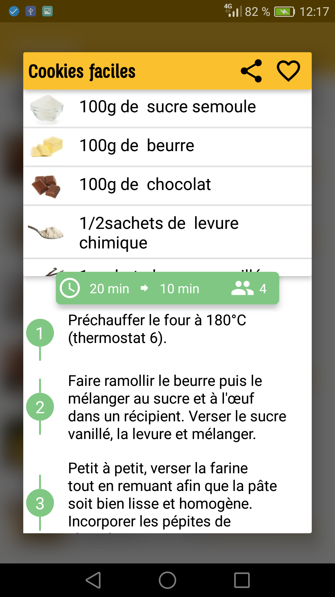

# Recipes
Android app that parse recipes from Marmiton.org

   

[This github](https://github.com/PaulLesur/marmiton-simple-API) really helped to understand how to use JSoup and as a base.

# Working
* Parsing recipes and details from marmiton.org
* Saving recipes on categorized databases
* Shopping list (long click an item or add it manually on drawer)
* Sharing recipes (http://www.recipe.com/&recipe1link&recipe2link : [mailto shortcut](mailto:?&subject=Recipes&body=http://www.recipe.com/%26recipe1%26recipe2 )) and categorizing on the fly

# Known bugs
* Rating not loaded when sharing
